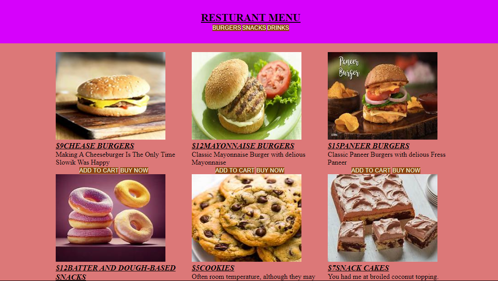

# Hi, I'm Harsh Mishra! 👋

## 🚀 I'm a full-stack developer...

## Project Title - 
### Reastaurent menu

A web application for managing and viewing restaurant menus. This project allows restaurants to showcase their dishes, categories (like starters, mains, and desserts), pricing, and descriptions in an easy-to-use interface for both admins and customers.

## Average time to complete
5 hrs

## Technology Used

## 🛠 Skills
HTML, CSS

## 📱 Responsive Design

The application is designed to be fully responsive across a wide range of devices, from mobile phones to large desktop screens.

## Demo | Netlify
https://mellifluous-cajeta-a405a7.netlify.app/

## Screenshots

## 🤝 Contributing

Contributions are welcome! If you'd like to improve this project, feel free to submit a pull request or open an issue for discussion.

## 📫 Contact
For any questions or feedback, reach out via:

**Email:** hm45676777776@gmail.com

**GitHub:** HarshMishra23

